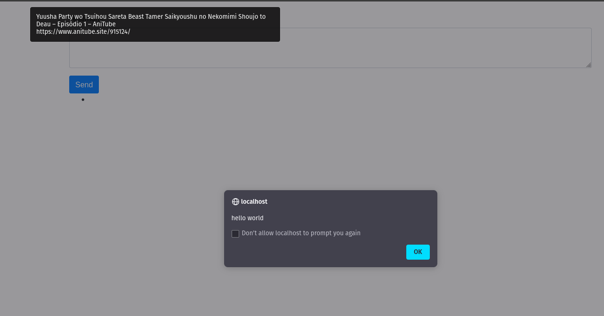
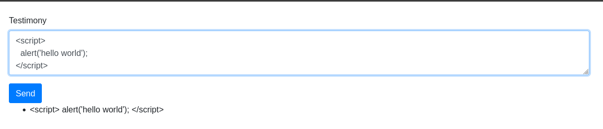

<p align="center">
  <a href="https://github.com/thiiagoms/xss-poc">
    
  </a>
     <h3 align="center">
        XSS Example Attack :sword:
     </h3>
</p>

Simple example of PHP vullnerable applicaton :face_with_thermometer:

- [Dependencies](#Dependencies)
- [Usage](#Usage)

### Dependencies
* PHP 7.4
* SQLite 3

### Usage

- Run server on `view.php` or just use `apache2` and access `view.php`: 
```bash
$ php -S localhost:8000 view.php
```

- With XSS Attack, uncomment line `28` on `view.php`
<p align="center">
    
</p>

- Without XSS Attack, uncomment line `29` on `view.php`
<p align="center">
    
</p>


If you want to contribute, you can also open issue or clone this repository to make a Pull Request, thank you so much!!!:purple_heart:
